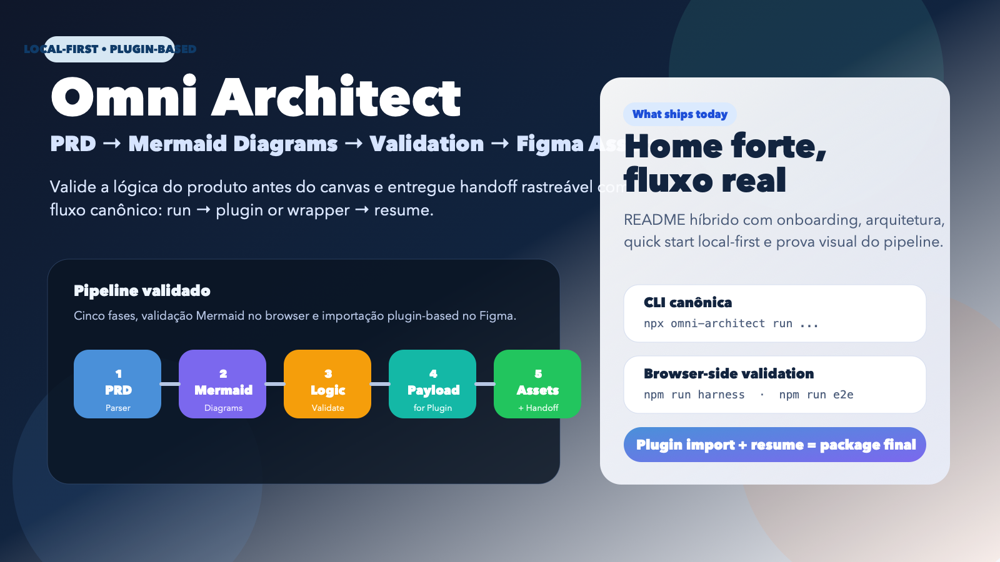
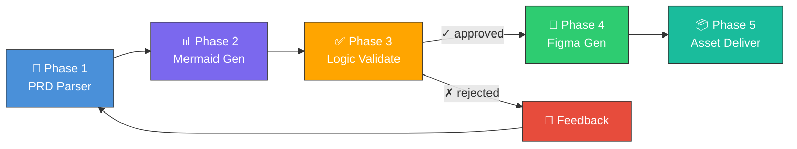
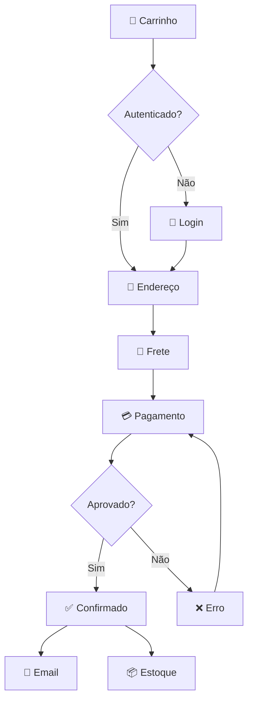

<div align="center">

# 🏗️ Omni Architect

### PRD → Mermaid Diagrams → Validation → Figma Assets

**A orquestração inteligente que transforma requisitos de produto em design validado.**

[](https://github.com/fabioeloi/omni-architect/stargazers)
[](https://github.com/fabioeloi/omni-architect/network/members)
[](https://github.com/fabioeloi/omni-architect/issues)
[](https://github.com/fabioeloi/omni-architect/blob/main/LICENSE)
[](https://github.com/fabioeloi/omni-architect/releases)
[](https://github.com/fabioeloi/omni-architect/commits/main)
[](https://github.com/fabioeloi/omni-architect/graphs/contributors)

[](https://skills.sh/fabioeloi/omni-architect)
[](https://agentskills.io)
[](https://www.figma.com/developers)
[](https://mermaid.js.org)

<br/>

[📖 Documentação](#-documentação) •
[🚀 Quick Start](#-quick-start) •
[🎯 Como Funciona](#-como-funciona) •
[📊 Exemplos](#-exemplos) •
[🤝 Contribuir](#-contribuir)

<br/>



</div>

---

## 💡 O Problema

Em times de produto, existe um **gap crítico** entre o PRD e o Design:

```
📄 PRD escrito ──── ❌ GAP ──── 🎨 Design no Figma
      │                                    │
      │  • Interpretação ambígua            │
      │  • Lógica não validada              │
      │  • Retrabalho constante             │
      │  • Ciclo de dias/semanas            │
      └────────────────────────────────────┘
```

## ✅ A Solução

O **Omni Architect** insere uma camada de **validação lógica via Mermaid** entre o PRD e o Figma:

```
📄 PRD ──→ 📊 Mermaid ──→ ✅ Validação ──→ 🎨 Figma
                │               │
                │  Diagramas    │  Score de
                │  de lógica    │  coerência
                │  do produto   │  automático
                └───────────────┘
```

> **Resultado**: redução de **70%+ no retrabalho** de design e **validação lógica garantida** antes de investir em assets visuais.

---

## 🎯 Como Funciona

O Omni Architect orquestra **5 fases** em um pipeline inteligente:



| Fase | Skill | Input | Output |
|------|-------|-------|--------|
| **1. PRD Parser** | `prd-parse` | PRD Markdown | Estrutura semântica (features, stories, entidades) |
| **2. Mermaid Gen** | `mermaid-gen` | PRD parseado | Diagramas Mermaid (flowchart, sequence, ER, etc.) |
| **3. Logic Validate** | `logic-validate` | Diagramas + PRD | Score de coerência + relatório de validação |
| **4. Figma Gen** | `figma-gen` | Diagramas validados | Assets no Figma (flows, specs, components) |
| **5. Asset Deliver** | `asset-deliver` | Todos os artefatos | Pacote consolidado de entrega |

---

## 🚀 Quick Start

### Pré-requisitos

- Node.js 18+
- Token de acesso Figma ([como gerar](https://www.figma.com/developers/api#access-tokens))
- `npx` (incluído com npm 5.2+)

### Instalação

```bash
# Instalar via skills CLI
npx skills add https://github.com/fabioeloi/omni-architect --skill omni-architect

# Ou clonar e instalar localmente
git clone https://github.com/fabioeloi/omni-architect.git
cd omni-architect
npm install
```

### Primeira Execução

```bash
# Execução mínima
skills run omni-architect \
  --prd_source "./docs/meu-prd.md" \
  --project_name "Meu Projeto" \
  --figma_file_key "SEU_FILE_KEY" \
  --figma_access_token "$FIGMA_TOKEN"
```

### Execução Completa

```bash
skills run omni-architect \
  --prd_source "./docs/meu-prd.md" \
  --project_name "Meu Projeto" \
  --figma_file_key "SEU_FILE_KEY" \
  --figma_access_token "$FIGMA_TOKEN" \
  --diagram_types '["flowchart","sequence","erDiagram","stateDiagram","C4Context","journey"]' \
  --design_system "material-3" \
  --validation_mode "interactive" \
  --validation_threshold 0.85 \
  --locale "pt-BR"
```

---

## 📊 Exemplos

### Exemplo: E-Commerce Platform

**Input** — PRD (trecho):

```markdown
## Feature: Checkout Flow

### User Story
Como **comprador**, quero **finalizar minha compra em até 3 passos**,
para que eu tenha uma **experiência rápida e sem fricção**.

### Acceptance Criteria
- [ ] Usuário pode selecionar endereço salvo ou cadastrar novo
- [ ] Cálculo de frete em tempo real
- [ ] Suporte a PIX, cartão e boleto
- [ ] Confirmação por email automática
```

**Output** — Mermaid Flowchart gerado:



**Output** — Validation Report:

```json
{
  "overall_score": 0.93,
  "status": "approved",
  "breakdown": {
    "coverage": { "score": 0.95, "weight": 0.25 },
    "consistency": { "score": 0.92, "weight": 0.25 },
    "completeness": { "score": 0.90, "weight": 0.20 },
    "traceability": { "score": 0.95, "weight": 0.15 },
    "naming_coherence": { "score": 0.90, "weight": 0.10 },
    "dependency_integrity": { "score": 1.00, "weight": 0.05 }
  }
}
```

**Output** — Estrutura Figma gerada:

```
📁 E-Commerce Platform - Omni Architect
├── 📄 Index
├── ���� User Flows
│   ├── 🖼️ Checkout Flow
│   ├── 🖼️ Authentication Flow
│   └── 🖼️ Product Search Flow
├── 📄 Interaction Specs
│   └── 🖼️ Checkout Sequence
├── 📄 Data Model
│   └── 🖼️ Domain ER Diagram
├── 📄 Architecture
│   └── 🖼️ C4 System Context
└── 📄 Component Library
    ├── 🧩 Design Tokens
    └── 🧩 Flow Connectors
```

> 📂 Veja o exemplo completo em [`examples/`](./examples/)

---

## ⚙️ Configuração

Crie um `.omni-architect.yml` na raiz do projeto:

```yaml
# .omni-architect.yml
project_name: "Meu Projeto"
figma_file_key: "abc123XYZ"
design_system: "material-3"     # material-3 | apple-hig | tailwind | custom
locale: "pt-BR"
validation_mode: "interactive"  # interactive | batch | auto
validation_threshold: 0.85

diagram_types:
  - flowchart
  - sequence
  - erDiagram
  - stateDiagram
  - C4Context

design_tokens:
  colors:
    primary: "#4A90D9"
    secondary: "#7B68EE"
    success: "#2ECC71"
    error: "#E74C3C"
    warning: "#FFA500"
  typography:
    font_family: "Inter"
    heading_size: 24
    body_size: 14
  spacing:
    base: 8
    scale: 1.5

hooks:
  on_validation_approved: "npm run generate:specs"
  on_figma_complete: "npm run notify:slack"
  on_error: "npm run alert:team"
```

> 📖 Documentação completa de configuração em [`docs/configuration.md`](./docs/configuration.md)

---

## 🧩 Skills Orquestradas

O Omni Architect é um **meta-skill** que orquestra skills especializadas:

| Skill Dependente | Fonte | Função |
|-----------------|-------|--------|
| `mermaid-diagrams` | [softaworks/agent-toolkit](https://skills.sh/softaworks/agent-toolkit/mermaid-diagrams) | Geração de diagramas Mermaid |
| `figma` | [hoodini/ai-agents-skills](https://skills.sh/hoodini/ai-agents-skills/figma) | Integração com API Figma |
| `prd-generator` | [jamesrochabrun/skills](https://skills.sh/jamesrochabrun/skills/prd-generator) | Parsing e estruturação de PRDs |
| `frontend-design` | [anthropics/skills](https://skills.sh/anthropics/skills/frontend-design) | Design frontend production-grade |
| `implement-design` | [figma/mcp-server-guide](https://skills.sh/figma/mcp-server-guide/implement-design) | Pixel-perfect Figma implementation |

---

## 📖 Documentação

| Documento | Descrição |
|-----------|-----------|
| [SKILL.md](./SKILL.md) | Especificação completa da skill (padrão agentskills.io) |
| [Architecture](./docs/architecture.md) | ADRs e decisões arquiteturais |
| [Configuration](./docs/configuration.md) | Guia completo de configuração |
| [API Reference](./docs/api-reference.md) | Referência de inputs/outputs |
| [CHANGELOG](./CHANGELOG.md) | Histórico de versões |

---

## 📈 Métricas & Qualidade

| Métrica | Target | Descrição |
|---------|--------|-----------|
| **PRD Coverage** | ≥ 90% | Features do PRD representadas em diagramas |
| **Validation Score** | ≥ 0.85 | Score mínimo para aprovação automática |
| **Figma Generation** | < 60s | Tempo para gerar assets por feature |
| **Retry Rate** | < 10% | Taxa de reprocessamento por erros |
| **Diagram Accuracy** | ≥ 95% | Precisão sintática dos Mermaids gerados |

---

## 🗺️ Roadmap

- [x] **v1.0** — Pipeline completo PRD → Mermaid → Figma
- [ ] **v1.1** — Suporte a Storybook export
- [ ] **v1.2** — Plugin VS Code com preview em tempo real
- [ ] **v1.3** — Suporte a design systems customizados (tokens arbitrários)
- [ ] **v2.0** — Code generation a partir dos Figma assets (React/Vue/Swift)
- [ ] **v2.1** — Integração com Jira/Linear para rastreabilidade bidirecional
- [ ] **v2.2** — Multi-PRD merge para projetos complexos
- [ ] **v3.0** — AI-powered design suggestions baseadas em heurísticas UX

---

## 🤝 Contribuir

Contribuições são muito bem-vindas! Veja o guia completo em [`CONTRIBUTING.md`](.github/CONTRIBUTING.md).

```bash
# Fork + Clone
git clone https://github.com/SEU_USER/omni-architect.git
cd omni-architect
npm install

# Crie uma branch
git checkout -b feature/minha-feature

# Faça suas alterações e teste
npm test

# Commit e push
git commit -m "feat: minha nova feature"
git push origin feature/minha-feature

# Abra um Pull Request 🎉
```

---

## 📄 Licença

Este projeto está licenciado sob a [MIT License](./LICENSE).

---

## ⭐ Star History

Se este projeto te ajudou, considere dar uma ⭐ — isso ajuda na descoberta e motiva o desenvolvimento!

[](https://star-history.com/#fabioeloi/omni-architect&Date)

---

## 🙏 Agradecimentos

- [agentskills.io](https://agentskills.io) — Padrão de skills para agentes
- [skills.sh](https://skills.sh) — Marketplace de skills
- [softaworks/agent-toolkit](https://github.com/softaworks/agent-toolkit) — Mermaid diagrams skill
- [hoodini/ai-agents-skills](https://github.com/hoodini/ai-agents-skills) — Figma skill
- [jamesrochabrun/skills](https://github.com/jamesrochabrun/skills) — PRD generator skill
- [anthropics/skills](https://github.com/anthropics/skills) — Frontend design & skill creator
- [Mermaid.js](https://mermaid.js.org) — Diagramas como código
- [Figma API](https://www.figma.com/developers) — Platform de design

---

<div align="center">

**Feito com 🧠 por [@fabioeloi](https://github.com/fabioeloi)**

[⬆ Voltar ao topo](#️-omni-architect)

</div>