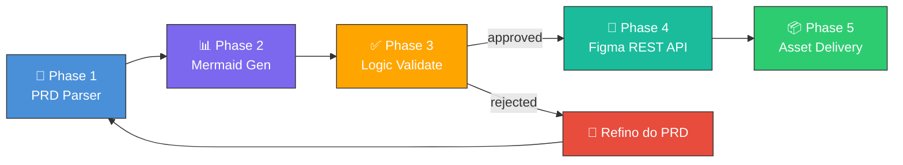
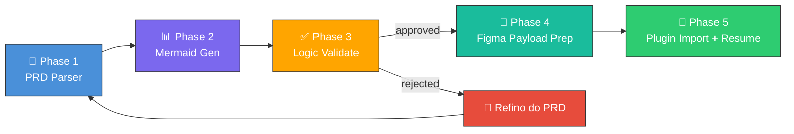
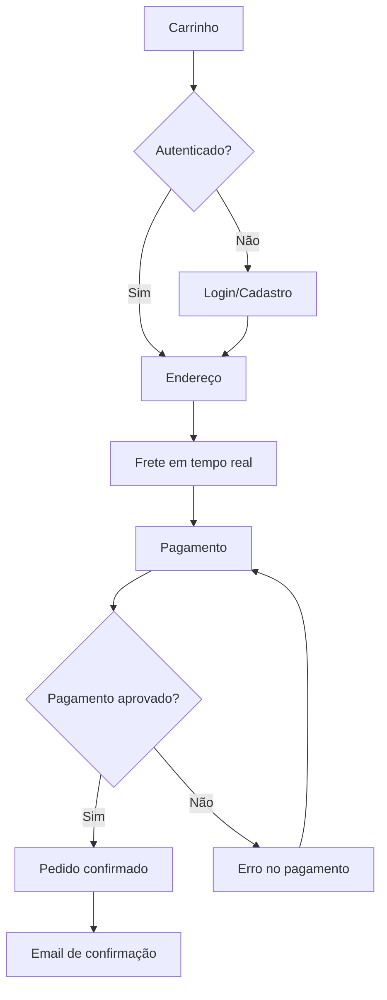

<div align="center">

# 🏗️ Omni Architect

### PRD → Mermaid Diagrams → Validation → Figma Assets

**A camada de validação que conecta requisitos de produto, lógica de negócio e design no Figma.**

[](https://github.com/fabioeloi/omni-architect/stargazers)
[](https://github.com/fabioeloi/omni-architect/network/members)
[](https://github.com/fabioeloi/omni-architect/issues)
[](https://github.com/fabioeloi/omni-architect/blob/main/LICENSE)
[](https://github.com/fabioeloi/omni-architect/releases)
[](https://github.com/fabioeloi/omni-architect/graphs/contributors)
[](https://skills.sh/fabioeloi/omni-architect)
[](https://agentskills.io)
[](https://developers.figma.com/docs/plugins/plugin-quickstart-guide/)
[](https://mermaid.js.org)

<br/>

[📖 Documentação](#-documentação) •
[🚀 Quick Start](#-quick-start) •
[🎯 Como Funciona](#-como-funciona) •
[📊 Exemplos](#-exemplos) •
[🤝 Contribuir](#-contribuir)

<br/>


</div>

---

## 💡 O Problema

Em times de produto, existe um gap crítico entre o PRD e a materialização visual do design:

```text
📄 PRD escrito ──── ❌ GAP ──── 🎨 Design no Figma
      │                                    │
      │  • interpretação ambígua            │
      │  • lógica não validada              │
      │  • retrabalho constante             │
      │  • baixa rastreabilidade            │
      └────────────────────────────────────┘
```

Esse intervalo normalmente custa tempo de produto, clareza de engenharia e qualidade de design.

## ✅ A Solução

O Omni Architect insere uma camada explícita de validação lógica via Mermaid antes da geração de assets:

```text
📄 PRD ──→ 📊 Mermaid ──→ ✅ Validação ──→ 🎨 Plugin Figma ──→ 📦 Handoff
                │               │
                │  fluxos       │  score de coerência
                │  sequências   │  rastreabilidade
                │  entidades    │  cobertura do PRD
                └───────────────┘
```

> Resultado: o time valida a lógica do produto antes de tocar o canvas, mantém rastreabilidade até o manifesto do Figma e fecha a entrega com `resume`.

---

## 🎯 Como Funciona

O Omni Architect oferece **duas formas de integração com Figma**:

### 🚀 Modo REST API (Novo - Recomendado para Automação)

Integração direta via Figma Agent API - sem etapas manuais:



**Vantagens:**
- ✅ **Totalmente automatizado** - sem importação manual
- ✅ **Compatível com CI/CD** - integração contínua
- ✅ **Mais rápido** - <30 segundos end-to-end
- ✅ **Ideal para pipelines** - atualização automática ao mudar PRD

### 🔌 Modo Plugin (Original - Estável)

Integração via Plugin Figma - com controle manual:



**Vantagens:**
- ✅ **Controle manual** - revisão antes de importar
- ✅ **Mais estável** - API madura
- ✅ **Funciona sem service token** - usa token pessoal

> 💡 **Novo!** Com a abertura do canvas Figma para agentes, você pode escolher o modo que melhor se adapta ao seu workflow. Veja [Figma Agent API Examples](./docs/figma-agent-api-examples.md) para detalhes.

| Fase | Input | Output |
|------|-------|--------|
| **1. PRD Parser** | PRD Markdown | `parsed-prd.json` com features, stories, entidades e fluxos |
| **2. Mermaid Gen** | PRD parseado | `diagrams/*.mmd` e modelos de render |
| **3. Logic Validate** | PRD + Mermaid | `validation-report.json` com score e warnings |
| **4. Figma Integration** | Diagramas validados | REST API (auto) ou `figma/figma-payload.json` (plugin) |
| **5. Asset Delivery** | Manifesto do Figma | `figma-assets.json`, `HANDOFF.md` e log consolidado |

### O que está pronto hoje

- CLI `run` e `resume`
- API programática `run(options)` e `resumeFigma(options)`
- **Integração REST API com Figma Agent API** (novo)
- **Modo híbrido: auto-seleção entre REST API e Plugin** (novo)
- harness local com preview Mermaid, wrapper do plugin e resumo da sessão
- e2e local com Playwright para Mermaid e plugin wrapper
- smoke local-only para Figma real
- preparo de release do plugin

### Escolhendo o modo de integração

```yaml
# .omni-architect.yml

# Modo REST API (automação total)
figma_service_token: "${FIGMA_SERVICE_TOKEN}"  # Service account
figma_integration_mode: "rest_api"

# Modo Plugin (controle manual)
figma_access_token: "${FIGMA_ACCESS_TOKEN}"    # Personal token
figma_integration_mode: "plugin"

# Modo Auto (recomendado - escolhe automaticamente)
figma_service_token: "${FIGMA_SERVICE_TOKEN}"  # Preferido
figma_access_token: "${FIGMA_ACCESS_TOKEN}"    # Fallback
figma_integration_mode: "auto"                 # Default
```

---

## 🚀 Quick Start

### Pré-requisitos

- Node.js 18+
- `npm`
- Chrome/Chromium para os scripts de browser
- opcional: arquivo de teste e plugin publicado/instalado no Figma para o smoke real

### Instalação

```bash
git clone https://github.com/fabioeloi/omni-architect.git
cd omni-architect
npm install
npm run e2e:install
```

### Caminho oficial: local-first

#### 1. Gerar os artefatos do PRD

```bash
npx omni-architect run \
  --prd_source ./examples/prd-ecommerce.md \
  --project_name "E-Commerce Platform" \
  --figma_file_key EXAMPLE_FILE_KEY \
  --figma_access_token EXAMPLE_TOKEN \
  --validation_mode auto \
  --output_dir ./output/example
```

Ou use o runner de exemplo:

```bash
npm run example
```

#### 2. Validar no harness local

```bash
npm run harness
```

O harness sobe por padrão em `http://127.0.0.1:4173`:

- `/mermaid`: render real dos `.mmd` no browser
- `/plugin-wrapper`: UI real do plugin hospedada localmente com mock de Figma
- `/summary`: resumo do pacote gerado

#### 3. Importar o payload

Você pode seguir por dois caminhos:

- local: abrir `http://127.0.0.1:4173/plugin-wrapper`, carregar o payload e gerar o manifesto
- Figma real: importar `output/example/figma/figma-payload.json` no plugin e exportar `figma-import-result.json`

#### 4. Consolidar a entrega com `resume`

```bash
npx omni-architect resume \
  --session_dir ./output/example \
  --figma_result ./output/playwright/local-flow/figma-import-result.json \
  --prd_source ./examples/prd-ecommerce.md \
  --project_name "E-Commerce Platform" \
  --figma_file_key EXAMPLE_FILE_KEY \
  --figma_access_token EXAMPLE_TOKEN
```

### Ecossistema de skills

O projeto continua documentado como skill e compatível com o ecossistema `skills.sh` / `agentskills.io`, mas a home principal usa o fluxo local como caminho oficial porque é o que está validado end-to-end neste repositório.

---

## 📊 Exemplos

### Exemplo: E-Commerce Platform

**Input** — trecho do PRD:

```markdown
## Feature: Checkout

### User Story
Como **comprador**, quero **finalizar minha compra em até 3 passos**,
para **ter experiência rápida**.

### Acceptance Criteria
- Máximo 3 passos no checkout
- Cálculo de frete em tempo real
- Suporte a PIX, cartão e boleto
- Email de confirmação automático
```

**Output** — Mermaid Flowchart gerado:



**Output** — Validation Report:

```json
{
  "overall_score": 0.98,
  "status": "approved",
  "breakdown": {
    "coverage": { "score": 1, "weight": 0.25 },
    "consistency": { "score": 1, "weight": 0.25 },
    "completeness": { "score": 0.92, "weight": 0.2 },
    "traceability": { "score": 1, "weight": 0.15 },
    "naming_coherence": { "score": 1, "weight": 0.1 },
    "dependency_integrity": { "score": 1, "weight": 0.05 }
  }
}
```

**Output** — Estrutura atual de assets no Figma:

```text
📁 E-Commerce Platform - Omni Architect
├── 📄 User Flows
│   └── 🖼️ Checkout Flow
├── 📄 Interaction Specs
│   ├── 🖼️ Authentication Sequence
│   └── 🖼️ Checkout Sequence
├── 📄 Data Model
│   └── 🖼️ Domain ER Diagram
├── 📄 Architecture
│   └── 🖼️ System Context
└── 📄 User Journeys
    └── 🖼️ Buyer Journey
```

> 📂 Veja o fluxo canônico em [`examples/prd-ecommerce.md`](./examples/prd-ecommerce.md) e o guia completo em [`docs/guia-leigo-prd-exemplo.md`](./docs/guia-leigo-prd-exemplo.md).

---

## ⚙️ Configuração

Exemplo mínimo de `.omni-architect.yml`:

```yaml
prd_source: "./examples/prd-ecommerce.md"
project_name: "E-Commerce Platform"
figma_file_key: "EXAMPLE_FILE_KEY"
figma_access_token: "EXAMPLE_TOKEN"
design_system: "material-3"
locale: "pt-BR"
validation_mode: "auto"
validation_threshold: 0.85
output_dir: "./output/example"

diagram_types:
  - flowchart
  - sequence
  - erDiagram
  - stateDiagram
  - C4Context
  - journey

hooks:
  on_validation_approved: "echo validation-approved"
  on_figma_complete: "echo figma-complete"
  on_error: "echo pipeline-error"
```

> 📖 Mais detalhes em [`docs/configuration.md`](./docs/configuration.md).

---

## 🧪 Fluxo Validado

### Scripts públicos

```bash
npm run example
npm run harness
npm run e2e:mermaid
npm run e2e
npm run e2e:figma:bootstrap
npm run e2e:figma
npm run docs:capture
npm run plugin:release:prepare
npm run lint
npm run validate
npm test
```

### O que cada script faz

- `npm run example`: gera o pacote `output/example`
- `npm run harness`: abre o preview local para os artefatos já gerados
- `npm run e2e:mermaid`: valida o render browser-side dos diagramas
- `npm run e2e`: valida `run -> preview Mermaid -> plugin wrapper -> resume`
- `npm run e2e:figma:bootstrap`: captura a sessão autenticada do Figma
- `npm run e2e:figma`: smoke local no Figma web com plugin instalado
- `npm run docs:capture`: recaptura as screenshots usadas na documentação
- `npm run plugin:release:prepare`: prepara o pacote de publicação do plugin

### Layout de saída

Depois de `run`:

```text
output/example/
├── diagrams/
├── figma/figma-payload.json
├── parsed-prd.json
├── validation-report.json
├── orchestration-log.json
├── HANDOFF.md
├── session.json
└── session-state.json
```

Depois de `resume`:

```text
output/example/
├── figma-assets.json
├── figma-import-result.json
└── HANDOFF.md
```

### Evidências do fluxo local

As imagens abaixo foram capturadas do harness local usando o PRD [`examples/prd-ecommerce.md`](./examples/prd-ecommerce.md).

#### Preview Mermaid


#### Wrapper do Plugin


#### Resumo Final


---

## 🧩 Ecossistema e Referências

| Bloco | Papel no projeto |
|-------|------------------|
| `skills.sh` / `agentskills.io` | distribuição e contexto de skill |
| `Mermaid` | diagramas como código para validar lógica de produto |
| `Figma Plugin API` | importação plugin-based e manifesto de assets |
| `Playwright` | validação browser-side, smoke local e captura de evidências |

---

## 📖 Documentação

| Documento | Descrição |
|-----------|-----------|
| [SKILL.md](./SKILL.md) | Especificação completa da skill |
| [Guia Leigo](./docs/guia-leigo-prd-exemplo.md) | Passo a passo validado para usuário não técnico |
| [E2E e Browser](./docs/e2e-playwright.md) | Arquitetura do harness, auth bootstrap e smoke Figma |
| [Configuration](./docs/configuration.md) | Campos suportados, defaults e hooks |
| [API Reference](./docs/api-reference.md) | CLI, API JS e contrato do plugin |
| [Architecture](./docs/architecture.md) | Módulos, fases e fluxo de dados |
| [Plugin Release](./docs/plugin-release.md) | Preparo de release e checklist de publicação |
| [CHANGELOG](./CHANGELOG.md) | Histórico de versões |

---

## 📈 Métricas & Qualidade

Metas do projeto:

| Métrica | Target | Descrição |
|---------|--------|-----------|
| **PRD Coverage** | ≥ 90% | features do PRD representadas nos diagramas |
| **Validation Score** | ≥ 0.85 | score mínimo para aprovação automática |
| **Mermaid Render Accuracy** | ≥ 95% | precisão de render e sintaxe dos `.mmd` |
| **Retry Rate** | < 10% | taxa de reprocessamento por inconsistências |
| **Local Flow Completion** | 100% | `run -> wrapper/plugin -> resume` reproduzível |

---

## 🗺️ Roadmap

- [x] **v1.0** — Pipeline local-first com `run`, harness, plugin import e `resume`
- [ ] **v1.1** — Ampliação do pacote de páginas/assets do plugin
- [ ] **v1.2** — Publicação mais guiada do plugin e smoke Figma mais robusto
- [ ] **v1.3** — Melhorias de review para `interactive` e `batch`
- [ ] **v2.0** — Geração de código a partir dos assets importados
- [ ] **v2.1** — Rastreabilidade bidirecional com ferramentas de produto

---

## 🤝 Contribuir

Contribuições são bem-vindas. O fluxo mínimo está em [`./.github/CONTRIBUTING.md`](./.github/CONTRIBUTING.md).

```bash
git clone https://github.com/fabioeloi/omni-architect.git
cd omni-architect
npm install

git checkout -b feature/minha-feature
npm run lint
npm run validate
npm test
```

Abra um Pull Request com:

- descrição clara da mudança
- impacto no fluxo `run -> plugin -> resume`
- evidência de teste quando houver mudança funcional

---

## 📄 Licença

Este projeto está licenciado sob a [MIT License](./LICENSE).

---

## ⭐ Star History

Se este projeto te ajudou, considere dar uma estrela.

[](https://star-history.com/#fabioeloi/omni-architect&Date)

---

## 🙏 Agradecimentos

- [agentskills.io](https://agentskills.io) — padrão de skills para agentes
- [skills.sh](https://skills.sh) — ecossistema e catálogo de skills
- [Mermaid.js](https://mermaid.js.org) — diagramas como código
- [Figma Developers](https://developers.figma.com) — plugin APIs e workflow oficial
- [Playwright](https://playwright.dev) — automação e validação browser-side

---

<div align="center">

**Feito por [@fabioeloi](https://github.com/fabioeloi)**  
[⬆ Voltar ao topo](#-omni-architect)

</div>
