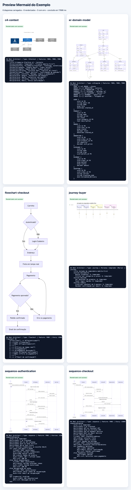
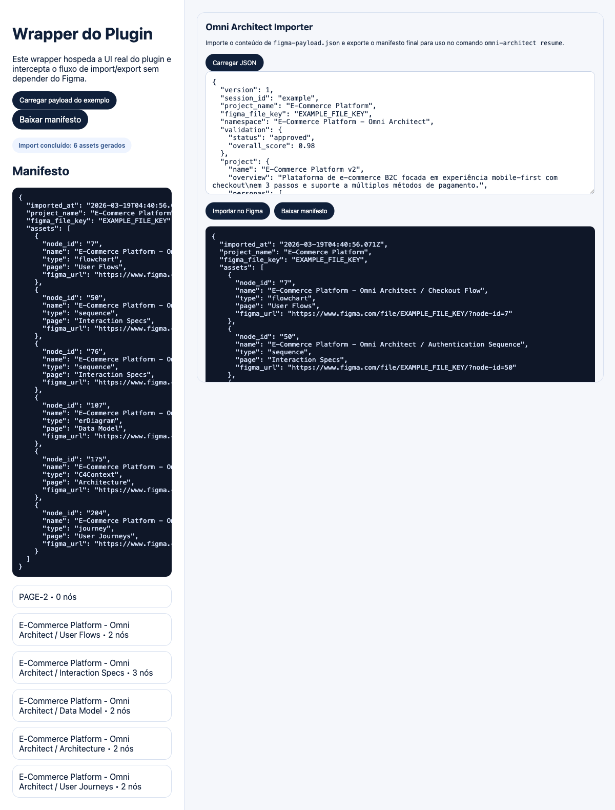
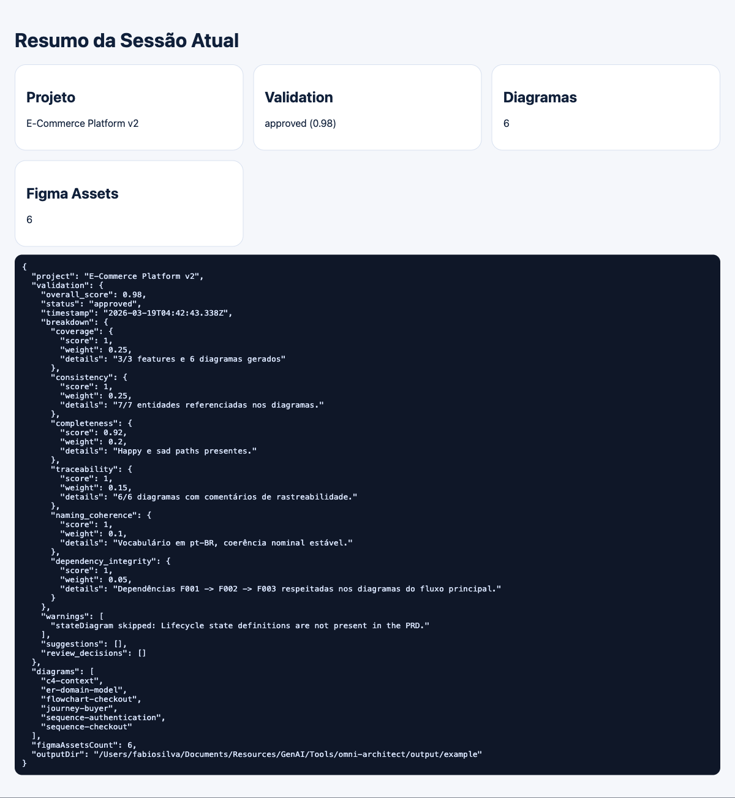

# 🏗️ Omni Architect

Omni Architect transforma um PRD em Markdown em um pacote de entrega com:

- PRD parseado
- diagramas Mermaid validados
- payload para importação no Figma
- manifesto de assets importados
- handoff final consolidado

O fluxo operacional desta versão é:

1. `run`: parsing + Mermaid + validação + `figma-payload.json`
2. importação no plugin do Figma ou no wrapper local do harness
3. `resume`: consolidação final de `figma-assets.json` e `HANDOFF.md`

## O que já está pronto

- CLI `run` e `resume`
- API programática `run(options)` e `resumeFigma(options)`
- harness web local para preview Mermaid e wrapper do plugin
- camada de browser com Playwright para scripts e2e
- preparo de release do plugin
- PRD de exemplo em [`examples/prd-ecommerce.md`](./examples/prd-ecommerce.md)

## Requisitos

- Node.js 18+
- `npm`
- para scripts de browser: Chrome/Chromium instalado e `npm run e2e:install`
- para smoke no Figma real: sessão autenticada e plugin já publicado/instalado no workspace de teste

## Instalação

```bash
npm install
npm run e2e:install
```

## Quick Start

### 1. Gerar os artefatos do PRD

```bash
npx omni-architect run \
  --prd_source ./examples/prd-ecommerce.md \
  --project_name "E-Commerce Platform" \
  --figma_file_key EXAMPLE_FILE_KEY \
  --figma_access_token EXAMPLE_TOKEN \
  --validation_mode auto \
  --output_dir ./output/example
```

Ou use o script de exemplo:

```bash
npm run example
```

### 2. Abrir o harness local

```bash
npm run harness
```

O harness sobe por padrão em `http://127.0.0.1:4173` e expõe:

- `/mermaid`: preview real no browser dos `.mmd`
- `/plugin-wrapper`: UI real do plugin hospedada localmente com mock de Figma
- `/summary`: resumo do pacote atual

### 3. Finalizar sem depender do Figma real

No browser:

1. abra `http://127.0.0.1:4173/plugin-wrapper`
2. clique em `Carregar payload do exemplo`
3. clique em `Importar no Figma`
4. salve o manifesto ou reaproveite o `output/playwright/local-flow/figma-import-result.json`

Depois finalize:

```bash
npx omni-architect resume \
  --session_dir ./output/example \
  --figma_result ./output/playwright/local-flow/figma-import-result.json \
  --prd_source ./examples/prd-ecommerce.md \
  --project_name "E-Commerce Platform" \
  --figma_file_key EXAMPLE_FILE_KEY \
  --figma_access_token EXAMPLE_TOKEN
```

### 4. Finalizar com Figma real

Se você já tiver o plugin instalado/publicado e um arquivo Figma de teste:

1. importe `output/example/figma/figma-payload.json` na UI do plugin
2. exporte `figma-import-result.json`
3. rode `resume` apontando para esse manifesto

## Scripts públicos

```bash
npm run example
npm run harness
npm run e2e:mermaid
npm run e2e
npm run e2e:figma:bootstrap
npm run e2e:figma
npm run docs:capture
npm run plugin:release:prepare
npm test
npm run lint
npm run validate
```

### O que cada script faz

- `npm run example`: roda o PRD de exemplo e gera `output/example`
- `npm run harness`: sobe o preview local para os artefatos já gerados
- `npm run e2e:mermaid`: valida render real dos diagramas no browser
- `npm run e2e`: valida `run -> preview Mermaid -> plugin wrapper -> resume`
- `npm run e2e:figma:bootstrap`: abre o browser em modo interativo e salva `storage state` do Figma
- `npm run e2e:figma`: smoke local no Figma web usando sessão autenticada
- `npm run plugin:release:prepare`: empacota o plugin e gera checklist de publicação
- `npm run docs:capture`: recaptura as screenshots usadas na documentação

## Layout de saída

Depois de `run`:

```text
output/example/
├── diagrams/
│   ├── c4-context.mmd
│   ├── er-domain-model.mmd
│   ├── flowchart-checkout.mmd
│   ├── journey-buyer.mmd
│   ├── sequence-authentication.mmd
│   └── sequence-checkout.mmd
├── figma/
│   └── figma-payload.json
├── parsed-prd.json
├── validation-report.json
├── orchestration-log.json
├── HANDOFF.md
├── session.json
└── session-state.json
```

Depois de `resume`:

```text
output/example/
├── figma-assets.json
├── figma-import-result.json
└── HANDOFF.md
```

## Documentação

- [Guia Leigo do PRD de Exemplo](./docs/guia-leigo-prd-exemplo.md)
- [Guia Técnico de Browser e E2E](./docs/e2e-playwright.md)
- [Configuração](./docs/configuration.md)
- [API e CLI](./docs/api-reference.md)
- [Arquitetura](./docs/architecture.md)
- [Release do Plugin](./docs/plugin-release.md)
- [SKILL.md](./SKILL.md)

## Evidências do fluxo local validado

As imagens abaixo foram capturadas do harness local com o PRD [`examples/prd-ecommerce.md`](./examples/prd-ecommerce.md):

### Preview Mermaid



### Wrapper do Plugin



### Resumo Final



## Limites e observações

- `figma_access_token` continua obrigatório por compatibilidade de contrato, mas a mutação do canvas nesta v1 é plugin-based.
- o smoke `e2e:figma` é local-only e depende de autenticação prévia, plugin disponível e arquivo Figma de teste.
- se o browser local não abrir no seu ambiente, rode primeiro `npm run e2e:install` e teste com Chrome/Chromium instalados.
- você pode forçar o launcher local com `OMNI_ARCHITECT_BROWSER_CHANNEL=chrome` ou apontar `OMNI_ARCHITECT_BROWSER_EXECUTABLE_PATH`.

## Licença

MIT.
