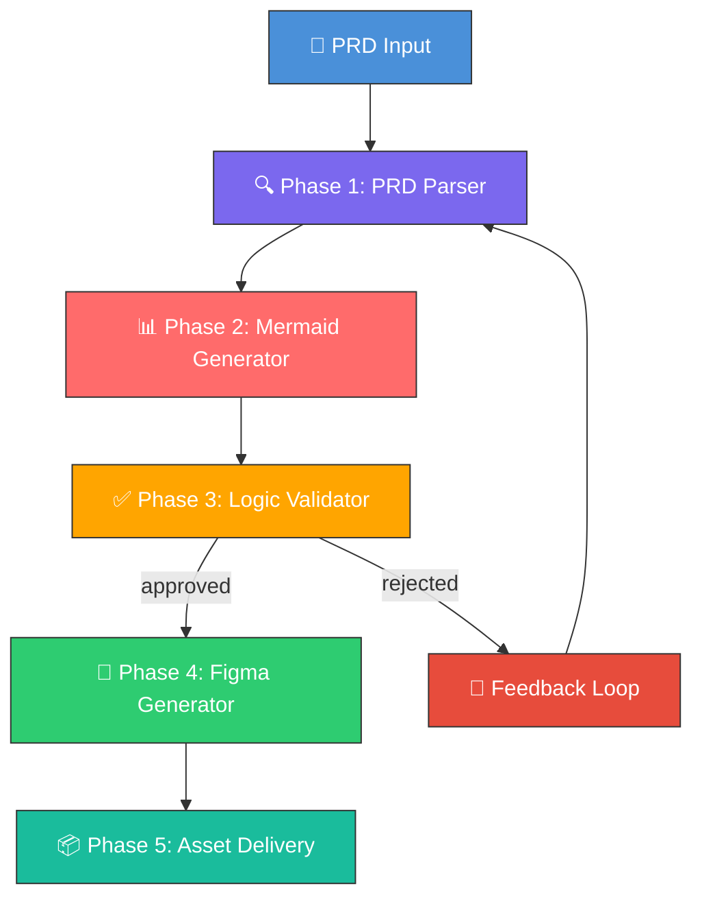
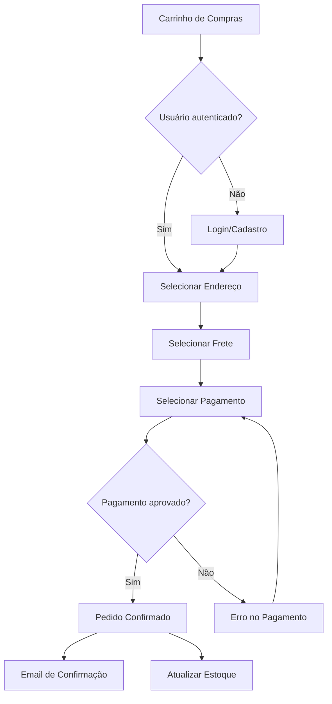
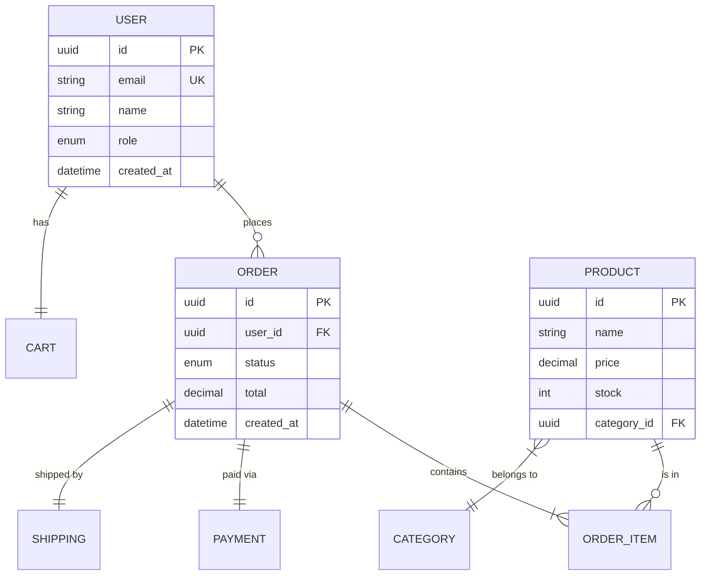
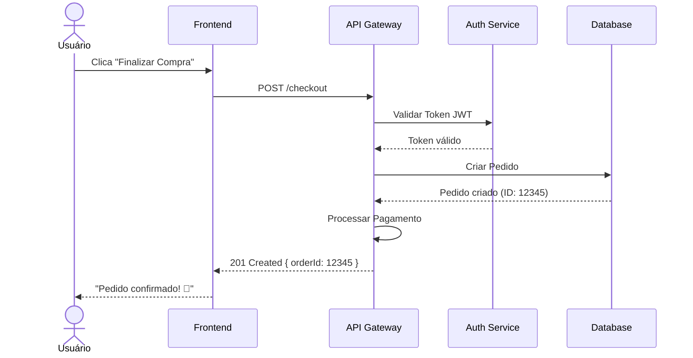

# 🏗️ Omni Architect

## Overview

**Omni Architect** é uma skill de orquestração de alto nível que implementa um pipeline
completo de **PRD → Mermaid Diagrams → Validação → Figma Assets**. Ela conecta múltiplas
skills especializadas em uma cadeia de execução inteligente, transformando requisitos de
produto em artefatos visuais validados.

### Problema que Resolve

Em times de produto, existe um gap significativo entre a escrita do PRD e a materialização
visual do design. Esse gap causa:

- **Retrabalho**: designers interpretam incorretamente requisitos
- **Inconsistências**: lógica do produto não é validada antes do design
- **Lentidão**: ciclo PRD → Design leva dias/semanas

O Omni Architect elimina esse gap automatizando o pipeline e inserindo um estágio
de validação lógica (via Mermaid) antes da geração visual (via Figma).

### Arquitetura do Pipeline



---

## Pipeline Phases

### Phase 1: PRD Parser (`prd-parse`)

Utiliza padrões do [prd-generator](https://skills.sh/jamesrochabrun/skills/prd-generator)
e [product-requirements](https://skills.sh/cexll/myclaude/product-requirements) para
extrair estrutura semântica do PRD.

**Extração realizada:**

| Elemento           | Descrição                                              |
|--------------------|--------------------------------------------------------|
| `features`         | Lista de funcionalidades com prioridade e complexidade |
| `user_stories`     | User stories no formato "Como X, quero Y, para Z"     |
| `entities`         | Entidades de domínio e seus atributos                  |
| `flows`            | Fluxos de negócio e suas etapas                        |
| `requirements`     | Requisitos funcionais e não-funcionais                 |
| `acceptance_criteria` | Critérios de aceite por feature                     |
| `dependencies`     | Dependências entre features                            |
| `personas`         | Personas identificadas                                 |

**Algoritmo de parsing:**

```
1. Tokenizar o PRD em seções por heading level (H1, H2, H3)
2. Classificar cada seção por tipo (feature, story, requirement, etc.)
3. Extrair entidades nomeadas (NER) para identificar domínio
4. Mapear relacionamentos entre entidades
5. Calcular grafo de dependências entre features
6. Gerar score de completude do PRD (0.0 - 1.0)
7. Se score < 0.6, emitir warnings com sugestões de melhoria
```

**Output de exemplo:**

```json
{
  "project": "E-Commerce Platform",
  "completeness_score": 0.87,
  "features": [
    {
      "id": "F001",
      "name": "User Authentication",
      "priority": "high",
      "complexity": "medium",
      "stories": ["US001", "US002"],
      "dependencies": []
    },
    {
      "id": "F002",
      "name": "Product Catalog",
      "priority": "high",
      "complexity": "high",
      "stories": ["US003", "US004", "US005"],
      "dependencies": ["F001"]
    }
  ],
  "entities": [
    {
      "name": "User",
      "attributes": ["id", "email", "name", "role", "created_at"],
      "relationships": [
        { "target": "Order", "type": "one-to-many" },
        { "target": "Cart", "type": "one-to-one" }
      ]
    }
  ]
}
```

---

### Phase 2: Mermaid Generator (`mermaid-gen`)

Baseada na skill [mermaid-diagrams](https://skills.sh/softaworks/agent-toolkit/mermaid-diagrams),
gera diagramas automaticamente a partir do PRD parseado.

**Mapeamento PRD → Diagrama:**

| Elemento PRD          | Tipo Mermaid       | Propósito                                    |
|------------------------|-------------------|----------------------------------------------|
| `flows`               | `flowchart TD`    | Visualizar fluxos de negócio                 |
| `user_stories`        | `sequenceDiagram` | Interações entre atores e sistema            |
| `entities`            | `erDiagram`       | Modelo de dados e relacionamentos            |
| `features.states`     | `stateDiagram-v2` | Máquinas de estado por feature               |
| `system_overview`     | `C4Context`       | Visão arquitetural de alto nível             |
| `personas + journeys` | `journey`         | User journey maps                            |
| `dependencies + timeline` | `gantt`       | Roadmap e dependências temporais             |

**Regras de geração:**

```
Para cada tipo de diagrama solicitado em diagram_types:
  1. Selecionar os elementos do PRD parseado relevantes
  2. Aplicar template Mermaid correspondente
  3. Resolver referências cruzadas entre entidades
  4. Adicionar labels no idioma configurado (locale)
  5. Validar sintaxe Mermaid (parser check)
  6. Calcular score de coerência com o PRD original
  7. Anexar metadata (source_features, coverage_percentage)
```

**Exemplo de geração — Flowchart a partir de um fluxo de checkout:**



**Exemplo de geração — ER Diagram:**



**Exemplo de geração — Sequence Diagram:**



---

### Phase 3: Logic Validator (`logic-validate`)

Motor de validação que analisa a coerência dos diagramas gerados contra o PRD original.

**Critérios de validação:**

| Critério                     | Peso  | Descrição                                                |
|------------------------------|-------|----------------------------------------------------------|
| `coverage`                   | 0.25  | % de features/stories representadas nos diagramas        |
| `consistency`                | 0.25  | Entidades e fluxos consistentes entre diagramas          |
| `completeness`               | 0.20  | Todos os caminhos (happy/sad path) representados         |
| `traceability`               | 0.15  | Rastreabilidade diagrama ↔ requisito do PRD             |
| `naming_coherence`           | 0.10  | Consistência de nomenclatura entre diagramas             |
| `dependency_integrity`       | 0.05  | Dependências entre features respeitadas                  |

**Cálculo do score:**

```
score_final = Σ (score_criterio × peso_criterio) para cada critério

Se validation_mode == "auto":
    Se score_final >= validation_threshold: APPROVED
    Senão: REJECTED + gerar feedback

Se validation_mode == "interactive":
    Apresentar cada diagrama + score ao usuário
    Aguardar input: approve / reject / modify
    Se modify: voltar à Phase 2 com feedback

Se validation_mode == "batch":
    Apresentar todos os diagramas + relatório consolidado
    Aguardar input: approve_all / reject_all / select
```

**Exemplo de validation report:**

```json
{
  "overall_score": 0.91,
  "status": "approved",
  "breakdown": {
    "coverage": { "score": 0.95, "details": "19/20 features cobertas" },
    "consistency": { "score": 0.88, "details": "Entidade 'Payment' diverge entre ER e Sequence" },
    "completeness": { "score": 0.90, "details": "Falta sad path em 'Recuperar Senha'" },
    "traceability": { "score": 0.93, "details": "Todos rastreáveis exceto US018" },
    "naming_coherence": { "score": 0.92, "details": "'Usuário' vs 'User' inconsistente" },
    "dependency_integrity": { "score": 0.98, "details": "Todas as deps respeitadas" }
  },
  "warnings": [
    "Entidade 'Payment' usa atributos diferentes no ER vs Sequence diagram",
    "User story US018 não possui representação visual"
  ],
  "suggestions": [
    "Padronizar nomenclatura para 'User' em todos os diagramas",
    "Adicionar fluxo de erro em 'Recuperar Senha'",
    "Mapear US018 no flowchart de autenticação"
  ]
}
```

---

### Phase 4: Figma Generator (`figma-gen`)

Baseada nas skills [figma](https://skills.sh/hoodini/ai-agents-skills/figma),
[implement-design](https://skills.sh/figma/mcp-server-guide/implement-design) e
[frontend-design](https://skills.sh/anthropics/skills/frontend-design), gera assets
de design no Figma a partir dos diagramas validados.

**Mapeamento Diagrama → Figma Asset:**

| Diagrama Mermaid     | Asset Figma                   | Descrição                              |
|----------------------|-------------------------------|----------------------------------------|
| `flowchart`          | User Flow Page                | Wireframes de fluxo com telas conectadas |
| `sequenceDiagram`    | Interaction Spec Component    | Especificação de interações por tela   |
| `erDiagram`          | Data Model Documentation      | Documentação visual do modelo de dados |
| `stateDiagram`       | State Management Component    | Estados de UI por componente           |
| `C4Context`          | Architecture Overview Page    | Diagrama arquitetural estilizado       |
| `journey`            | User Journey Map Frame        | Mapa visual da jornada do usuário      |

**Processo de geração:**

```
1. Conectar à API Figma usando figma_access_token
2. Criar/identificar página no arquivo (figma_file_key)
3. Para cada diagrama validado:
   a. Determinar o design_system base (Material 3, Apple HIG, etc.)
   b. Criar Frame principal com auto-layout
   c. Mapear nós do diagrama → componentes Figma
   d. Aplicar design tokens (cores, tipografia, espaçamento)
   e. Criar conexões visuais entre componentes (arrows, lines)
   f. Gerar variantes (mobile, tablet, desktop) se aplicável
   g. Adicionar anotações de desenvolvimento
   h. Registrar node_id e preview_url no output
4. Criar página de índice com links para todos os frames
5. Gerar component library com tokens reutilizáveis
```

**Estrutura gerada no Figma:**

```
📁 {project_name} - Omni Architect
├── 📄 Index (Página de Navegação)
├── 📄 User Flows
│   ├── 🖼️ Flow: Checkout
│   ├── 🖼️ Flow: Authentication
│   └── 🖼️ Flow: Product Search
├── 📄 Interaction Specs
│   ├── 🖼️ Sequence: Checkout Process
│   └── 🖼️ Sequence: User Registration
├── 📄 Data Model
│   └── 🖼️ ER: Domain Model
├── 📄 Architecture
│   └── 🖼️ C4: System Context
├── 📄 User Journeys
│   ├── 🖼️ Journey: New User Onboarding
│   └── 🖼️ Journey: Returning Customer
└── 📄 Component Library
    ├── 🧩 Design Tokens
    ├── 🧩 Flow Connectors
    └── 🧩 Annotation Components
```

---

### Phase 5: Asset Delivery (`asset-deliver`)

Consolida todos os outputs e gera o pacote final de entrega.

**Deliverables:**

| Artefato                  | Formato          | Descrição                                      |
|---------------------------|------------------|-------------------------------------------------|
| PRD Parseado              | JSON             | Estrutura semântica extraída do PRD              |
| Diagramas Mermaid         | .mmd + SVG/PNG   | Código fonte + renders dos diagramas            |
| Relatório de Validação    | JSON + Markdown  | Score e detalhes da validação lógica            |
| Figma Assets              | Figma Nodes      | Links diretos para os frames no Figma           |
| Orchestration Log         | JSON             | Log completo com métricas e timeline            |
| Design Handoff Doc        | Markdown         | Documento de handoff para desenvolvedores       |

---

## Usage

### Instalação

```bash
# Instalar a skill omni-architect e suas dependências
npx skills add https://github.com/fabioeloi/omni-architect --skill omni-architect

# Ou instalar skills individuais separadamente
npx skills add https://github.com/softaworks/agent-toolkit --skill mermaid-diagrams
npx skills add https://github.com/hoodini/ai-agents-skills --skill figma
npx skills add https://github.com/jamesrochabrun/skills --skill prd-generator
npx skills add https://github.com/anthropics/skills --skill frontend-design
```

### Execução Básica

```bash
skills run omni-architect \
  --prd_source "./docs/prd-ecommerce-v2.md" \
  --project_name "E-Commerce Platform" \
  --figma_file_key "abc123XYZ" \
  --figma_access_token "$FIGMA_TOKEN"
```

### Execução com Todas as Opções

```bash
skills run omni-architect \
  --prd_source "./docs/prd-ecommerce-v2.md" \
  --project_name "E-Commerce Platform" \
  --figma_file_key "abc123XYZ" \
  --figma_access_token "$FIGMA_TOKEN" \
  --diagram_types '["flowchart","sequence","erDiagram","stateDiagram","C4Context","journey"]' \
  --design_system "material-3" \
  --validation_mode "interactive" \
  --validation_threshold 0.85 \
  --locale "pt-BR"
```

### Uso Programático (em outro skill)

```javascript
const omniArchitect = require('omni-architect');

const result = await omniArchitect.run({
  prd_source: fs.readFileSync('./prd.md', 'utf-8'),
  project_name: 'My SaaS App',
  figma_file_key: 'abc123XYZ',
  figma_access_token: process.env.FIGMA_TOKEN,
  diagram_types: ['flowchart', 'sequence', 'erDiagram'],
  design_system: 'tailwind',
  validation_mode: 'auto',
  validation_threshold: 0.9,
  locale: 'pt-BR'
});

console.log(`Status: ${result.validation_report.status}`);
console.log(`Figma assets criados: ${result.figma_assets.length}`);
console.log(`Score de coerência: ${result.validation_report.overall_score}`);
```

---

## Edge Cases & Error Handling

| Cenário                                 | Comportamento                                                |
|-----------------------------------------|--------------------------------------------------------------|
| PRD incompleto (score < 0.6)            | Emite warnings + sugestões, continua com dados disponíveis   |
| PRD sem user stories                    | Gera somente ER e C4, pula sequence diagrams                 |
| Mermaid syntax inválida                 | Retry com correção automática (max 3 tentativas)             |
| Figma API rate limit                    | Exponential backoff (1s, 2s, 4s, 8s) com max 5 retries      |
| Figma token expirado                    | Erro claro com instrução para renovar token                  |
| Validação rejeitada (interactive)       | Captura feedback do usuário e regenera diagrama específico   |
| Entidades ambíguas no PRD               | Lista ambiguidades no validation_report.warnings             |
| Diagrama muito complexo (>100 nós)      | Auto-split em sub-diagramas com diagrama de índice           |
| Network timeout                         | Retry com timeout progressivo, salva estado para resumo      |
| PRD em idioma diferente do locale       | Auto-detecta idioma e traduz labels conforme locale config   |

---

## Configuration File (Optional)

Crie um arquivo `.omni-architect.yml` na raiz do projeto para configurações persistentes:

```yaml
# .omni-architect.yml
project_name: "E-Commerce Platform"
figma_file_key: "abc123XYZ"
design_system: "material-3"
locale: "pt-BR"
validation_mode: "interactive"
validation_threshold: 0.85

diagram_types:
  - flowchart
  - sequence
  - erDiagram
  - stateDiagram
  - C4Context

# Custom design tokens para Figma
design_tokens:
  colors:
    primary: "#4A90D9"
    secondary: "#7B68EE"
    success: "#2ECC71"
    error: "#E74C3C"
    warning: "#FFA500"
  typography:
    font_family: "Inter"
    heading_size: 24
    body_size: 14
  spacing:
    base: 8
    scale: 1.5

# Hooks para integração com CI/CD
hooks:
  on_validation_approved: "npm run generate:specs"
  on_figma_complete: "npm run notify:slack"
  on_error: "npm run alert:team"
```

---

## Best Practices & Safety

1. **Nunca exponha tokens em logs** — o orchestration_log sanitiza automaticamente valores sensíveis
2. **Valide o PRD antes** — quanto mais completo o PRD, melhores os diagramas gerados
3. **Use modo interactive na primeira execução** — para calibrar a qualidade antes de usar auto
4. **Revise entidades do ER Diagram** — são a base para todo o restante do pipeline
5. **Mantenha o PRD atualizado** — re-execute após mudanças significativas no escopo
6. **Use design tokens customizados** — para garantir alinhamento com o brand guide existente
7. **Configure hooks** — para integrar com seu workflow existente (Slack, Jira, CI/CD)

---

## Troubleshooting

| Problema                          | Solução                                                    |
|-----------------------------------|------------------------------------------------------------|
| "PRD parsing failed"              | Verifique se o PRD segue estrutura Markdown com headings   |
| "Mermaid syntax error"            | Cheque caracteres especiais no PRD (quotes, brackets)      |
| "Figma API 403"                   | Verifique permissões do token e acesso ao arquivo          |
| "Low coverage score"              | Adicione mais detalhes nas seções de fluxos e stories      |
| "Diagrams not matching PRD"       | Use validation_mode=interactive para feedback granular     |
| "Rate limit exceeded"             | Aguarde 60s ou use uma service account Figma               |
| "Timeout on large PRD"            | Divida o PRD em módulos e execute por módulo               |

---

## Changelog

- `1.0.0` (2026-02-06) — Release inicial com pipeline completo PRD → Mermaid → Figma

---

## Architecture Decision Records

### ADR-001: Pipeline Sequencial com Feedback Loop

**Decisão**: Pipeline linear com possibilidade de retorno à Phase 2 após rejeição.
**Motivação**: Garante que nenhum asset Figma é gerado sem validação prévia da lógica.
**Consequência**: Pode aumentar o tempo total, mas reduz drasticamente o retrabalho.

### ADR-002: Mermaid como Linguagem Intermediária

**Decisão**: Usar Mermaid como representação intermediária entre PRD e Figma.
**Motivação**: Mermaid é text-based (versionável), amplamente suportado, e renderizável
sem ferramentas externas. Permite validação lógica antes do investimento em design.
**Consequência**: Algumas limitações visuais do Mermaid não se traduzem 1:1 para Figma.

### ADR-003: Score de Coerência Ponderado

**Decisão**: Usar score ponderado com 6 critérios para validação.
**Motivação**: Permite calibração fina do que é considerado "válido" por projeto.
**Consequência**: Requer tuning inicial do threshold por equipe/projeto.

---

_Para contribuições, issues ou suporte: [github.com/fabioeloi/omni-architect](https://github.com/fabioeloi/omni-architect)_