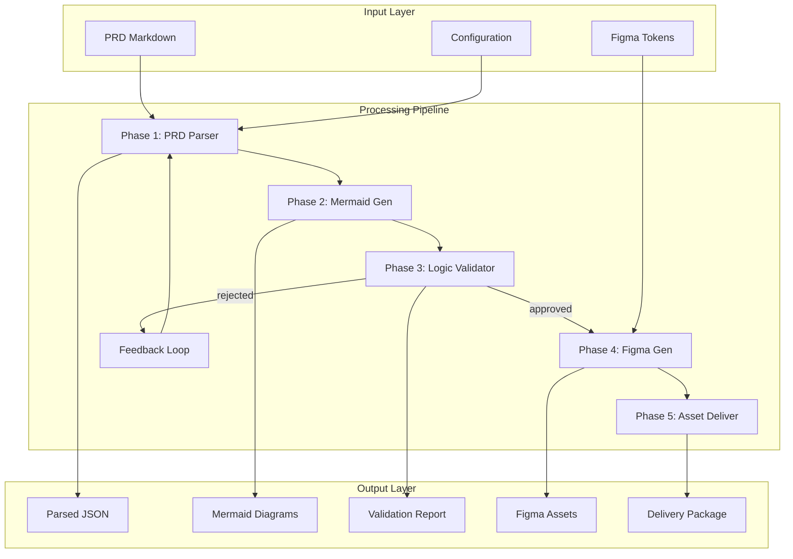

# Architecture Documentation

## Omni Architect Pipeline Architecture

O Omni Architect é um meta-skill que implementa um pipeline de orquestração em 5 fases para transformar PRDs (Product Requirements Documents) em design assets validados no Figma.

## Visão Geral do Sistema



## Decisões Arquiteturais (ADRs)

### ADR-001: Pipeline Linear com Validação Intermediária

**Status**: Aceito

**Contexto**: 
Precisávamos definir como orquestrar múltiplas skills especializadas mantendo qualidade e permitindo feedback.

**Decisão**: 
Implementar pipeline linear com gate de validação obrigatório na Fase 3, antes da geração de Figma assets.

**Consequências**:
- ✅ Garante que apenas lógica validada vai para design
- ✅ Reduz retrabalho em assets visuais
- ✅ Permite iteração rápida em Mermaid antes de Figma
- ⚠️ Adiciona latência ao pipeline (mas necessária)
- ⚠️ Requer critérios de validação bem calibrados

**Alternativas Consideradas**:
1. Pipeline totalmente paralelo - rejeitado por falta de validação
2. Validação apenas no final - rejeitado por custo de retrabalho
3. Validação manual obrigatória - rejeitado por não escalar

### ADR-002: Mermaid como Linguagem Intermediária

**Status**: Aceito

**Contexto**:
Necessidade de representação intermediária da lógica do produto que seja:
- Human-readable
- Machine-parseable
- Versionável
- Semanticamente rica

**Decisão**:
Usar Mermaid.js como formato intermediário entre PRD e Figma, suportando múltiplos tipos de diagrama.

**Consequências**:
- ✅ Diagramas são texto puro (Git-friendly)
- ✅ Preview imediato em GitHub, VS Code, etc
- ✅ Ecosistema rico de ferramentas Mermaid
- ✅ Múltiplos tipos: flowchart, sequence, ER, state, C4
- ⚠️ Limitações sintáticas do Mermaid às vezes restringem expressividade
- ⚠️ Parsing de Mermaid para Figma requer mapeamento customizado

**Alternativas Consideradas**:
1. PlantUML - rejeitado por sintaxe menos intuitiva
2. JSON direto - rejeitado por baixa legibilidade
3. DSL customizada - rejeitado por falta de ecossistema

### ADR-003: Scoring Multi-Critério para Validação

**Status**: Aceito

**Contexto**:
Validação lógica precisa ser objetiva, numérica e configurável para permitir diferentes rigor em diferentes contextos.

**Decisão**:
Implementar sistema de scoring com 6 critérios ponderados:
- Coverage (0.25)
- Consistency (0.25)
- Completeness (0.20)
- Traceability (0.15)
- Naming Coherence (0.10)
- Dependency Integrity (0.05)

Threshold padrão: 0.85

**Consequências**:
- ✅ Validação objetiva e repetível
- ✅ Diferentes modos: interactive, batch, auto
- ✅ Feedback granular por critério
- ✅ Configurável via threshold
- ⚠️ Pesos precisam ser calibrados empiricamente
- ⚠️ Alguns aspectos qualitativos difíceis de quantificar

**Alternativas Consideradas**:
1. Aprovação manual apenas - rejeitado por não escalar
2. Checklist binária - rejeitado por falta de nuance
3. ML-based scoring - rejeitado por complexidade inicial

### ADR-004: Figma como Platform de Output

**Status**: Aceito

**Contexto**:
Precisávamos de uma plataforma de design que:
- Tenha API robusta
- Seja industry-standard
- Permita colaboração
- Integre com development workflows

**Decisão**:
Usar Figma API v1 como target para geração de design assets, estruturando output em páginas especializadas.

**Consequências**:
- ✅ Figma é padrão de mercado em product design
- ✅ API bem documentada e estável
- ✅ Integração com dev tools (Storybook, code gen)
- ✅ Permite iterar manualmente após geração automática
- ⚠️ Requer token de acesso e file key
- ⚠️ Rate limits da API podem afetar throughput

**Alternativas Consideradas**:
1. Sketch - rejeitado por API limitada
2. Adobe XD - rejeitado por roadmap incerto
3. SVG files - rejeitado por falta de colaboração

### ADR-005: Configuração via YAML

**Status**: Aceito

**Contexto**:
Pipeline requer múltiplas configurações: design tokens, tipos de diagrama, thresholds, hooks, etc.

**Decisão**:
Usar arquivo `.omni-architect.yml` na raiz do projeto para configuração declarativa.

**Consequências**:
- ✅ Human-readable e Git-friendly
- ✅ Comentários inline para documentação
- ✅ Suporta estruturas complexas (design tokens, hooks)
- ✅ Padrão comum em ferramentas de desenvolvimento
- ⚠️ Requer validação de schema
- ⚠️ Alguns usuários podem preferir JSON

**Alternativas Consideradas**:
1. JSON - rejeitado por falta de comentários
2. TOML - rejeitado por menor adoção
3. JS/TS config - rejeitado por necessitar runtime

## Padrões de Integração

### Skill Dependency Model

O Omni Architect depende de skills externas:

```yaml
dependencies:
  - softaworks/agent-toolkit/mermaid-diagrams
  - hoodini/ai-agents-skills/figma
  - jamesrochabrun/skills/prd-generator
  - anthropics/skills/frontend-design
```

Cada dependency é resolvida via skills CLI no momento da execução.

### Error Handling Strategy

```
Transient Errors (network, API rate limit):
  → Retry with exponential backoff (max 3x)

Validation Errors (invalid PRD, malformed Mermaid):
  → Fail fast com mensagem clara + exemplos

Permission Errors (Figma token, file access):
  → Fail com instruções de correção

Logic Errors (threshold not met):
  → Interactive mode: solicita aprovação manual
  → Auto mode: rejeita e gera relatório
```

### Observability

Cada fase emite logs estruturados:

```json
{
  "timestamp": "2026-02-06T17:30:00Z",
  "phase": "mermaid-gen",
  "level": "info",
  "message": "Generated 3 diagrams",
  "metadata": {
    "diagram_types": ["flowchart", "sequence", "erDiagram"],
    "total_nodes": 45,
    "duration_ms": 1234
  }
}
```

## Performance Considerations

### Latency Budget por Fase

| Fase | Target | P95 | Notes |
|------|--------|-----|-------|
| Phase 1 | < 5s | < 10s | PRD parsing, bounded by document size |
| Phase 2 | < 30s | < 60s | Mermaid generation, parallelizable |
| Phase 3 | < 10s | < 20s | Validation scoring, CPU-bound |
| Phase 4 | < 45s | < 90s | Figma API calls, rate-limited |
| Phase 5 | < 5s | < 10s | Asset packaging, I/O-bound |
| **Total** | **< 95s** | **< 190s** | End-to-end for average PRD |

### Optimization Strategies

1. **Parallel Diagram Generation**: Phase 2 gera múltiplos diagramas em paralelo
2. **Caching**: PRDs parseados podem ser cached para iterações
3. **Batch Figma Operations**: Agrupa API calls para reduzir round-trips
4. **Incremental Updates**: Em re-runs, só regenera o que mudou

## Security Model

### Secrets Management

```yaml
# Nunca commitado em .omni-architect.yml
figma_access_token: # via environment variable FIGMA_ACCESS_TOKEN
```

### Permission Model

```yaml
permissions:
  - figma.api.write
  - figma.api.read
  - filesystem.read
  - filesystem.write
  - network.https
```

### Data Privacy

- PRDs podem conter informação sensível → nunca enviados para serviços externos sem consentimento
- Figma tokens com escopo mínimo necessário
- Output local por padrão

## Extensibility Points

### Custom Validators

```javascript
// hooks.on_validation_approved
module.exports = async (validationReport) => {
  // Custom validation logic
  if (validationReport.myCustomCriteria < threshold) {
    throw new Error('Custom validation failed');
  }
};
```

### Custom Diagram Types

```yaml
# .omni-architect.yml
diagram_types:
  - flowchart
  - custom_diagram_type  # requires custom generator
```

### Custom Design Systems

```yaml
design_system: "custom"
design_tokens:
  # Your custom token structure
```

## Deployment Patterns

### Local Development
```bash
npx skills run omni-architect --config .omni-architect.yml
```

### CI/CD Integration
```yaml
# .github/workflows/design.yml
- name: Generate Design Assets
  run: |
    npx skills run omni-architect \
      --prd_source docs/prd.md \
      --figma_access_token ${{ secrets.FIGMA_TOKEN }}
```

### API Service (Future)
```
POST /api/v1/orchestrate
{
  "prd_source": "...",
  "config": { ... }
}
```

## Versioning & Compatibility

- **Semantic Versioning**: MAJOR.MINOR.PATCH
- **Breaking Changes**: Alteram contract de inputs/outputs
- **API Compatibility**: Mantida dentro de mesma major version
- **Skill Dependencies**: Pinned versions no package.json

## Monitoring & Metrics

### Key Metrics

1. **Success Rate**: % de runs que completam todas as 5 fases
2. **Validation Pass Rate**: % que passa Phase 3 sem iteração
3. **Average Latency**: Tempo médio end-to-end
4. **Error Distribution**: Por fase e tipo de erro
5. **Asset Quality**: Feedback subjetivo dos designers

### Health Checks

```bash
# Verifica todas as dependencies
skills health-check omni-architect

# Valida configuração
skills validate-config .omni-architect.yml
```

---

**Última Atualização**: 2026-02-06  
**Versão**: 1.0.0  
**Mantainer**: [@fabioeloi](https://github.com/fabioeloi)
